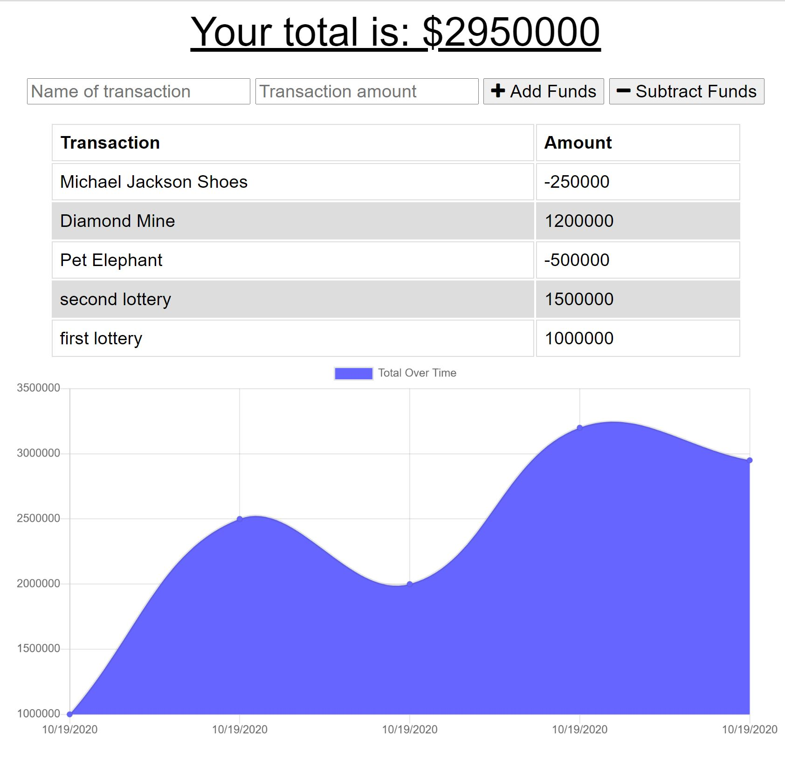
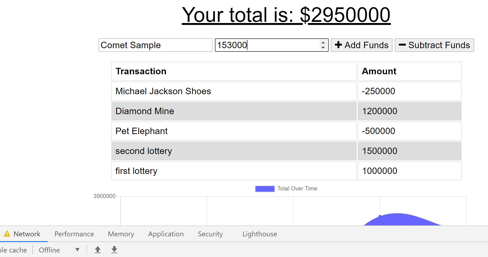
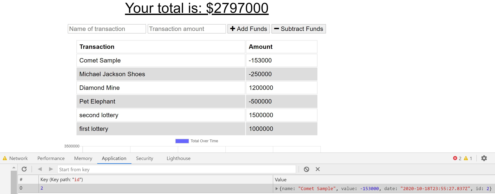
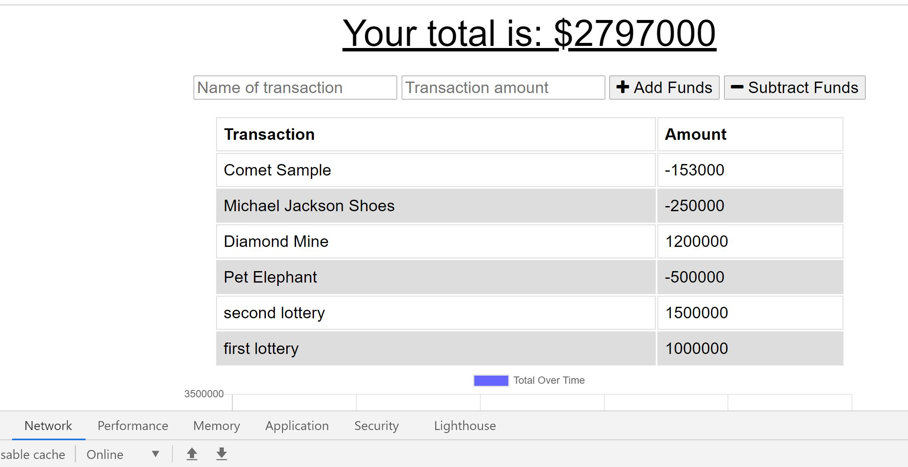

  # PWA: Offline Budget Tracker  
  
   
  
  ## Table of Contents
  
  - [Description](#description)
  - [Installation](#installation)
  - [Usage](#usage)
  - [License](#license)
  - [Contribution](#contribution)
  - [Test](#test)
  - [Authors](#authors)
  - [Questions](#questions)
  
   
  
  ## Description  
  
  This is a Progressive Web Application Project. It enables the user to make offline purchases and account credits and still be able to recover once network is restored. Webpack is used to compile offline caches of the identified pages and stored in the local client side for each page refresh. When there is an outage, IndexedDB is employed to temporarily hold the files awaiting sync with the backend and a user can continue to update their financial records as though there is still network. Once the network connectivity is restored, a refresh will trigger a resync of the cached contents via an active bulk post to the database from the IndexedDB The front end of the project is mainly provided. Most of the efforts is to chunk the original index file into multiple modules for maintainability, incoporate the indexedDb into the application for offline file sync, implement PWA using service worker and webpack. A few of the technologies employed included - HTML, CSS, Node.JS, MongoDB, Express among others.
  

## Business Context

The user will be able to add expenses and deposits to their budget with or without a connection. When entering transactions offline, they should populate the total when brought back online.
  
  ## Installation
  
  Connect to the provided project url and start using.
  
  ## Usage
  
Please clone the project to your local repo, install the dependencies, start the app by running npm start. You can also use the hosted application on Heroku. 

 
 
 
 
  
  ## License
  
  This project is licensed under:
  
   
  
  MIT
  
  ## Contribution
  
  Please contact me on my email [Email Address](anyaegbufrancis@gmail.com) or fork the repository from my github account: [Github Profile](https://github.com/anyaegbufrancis). Please make a pull request and we can review the updates, corrections or bug fixes together.
  
  ## Test
  
  Please click the below to see the feature demo on Heroku: https://offlinebudgetracker.herokuapp.com/
  
  
  
  ## Authors
  
  The author of this project is: 
  
  Francis Anyaegbu. 
  
  To contribute, please refer to [Contributors](#contributors) section.
  
  ## Questions
  
  For questions, concerns, comments or your valued inputs regargind this README.md generator, kindly go to my Github page or contact me on my email address below:
    
  - [Github Profile](https://github.com/anyaegbufrancis)
                    
  - [Email Address](anyaegbufrancis@gmail.com)
